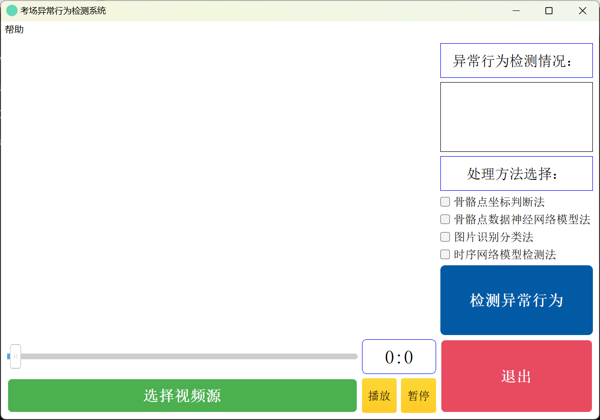

# Smart_Classroom_Detections_of_Examing
A College Project from NUAA with theme of smart classroom, it can open a video which contains the process of examing and process it to detect the abnormal actions during the exams. Also, we design the visual pages for it to easy use.
Datasets should be kept in gcn/dataset/myDataset, we don't upload it in this repository.
